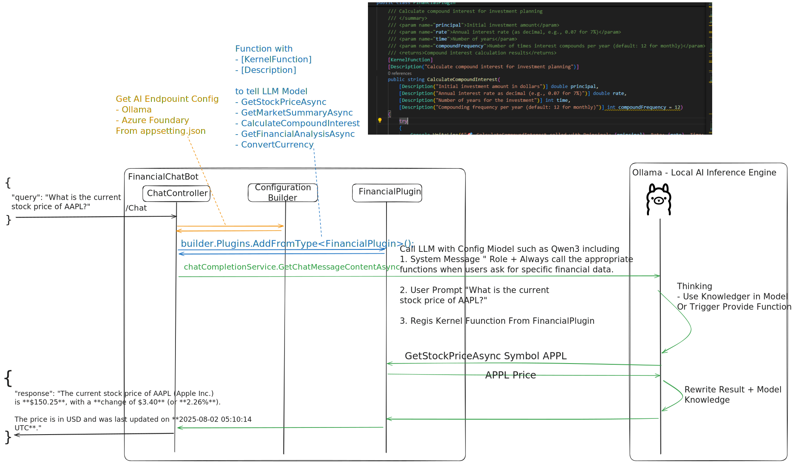

# Semantic Kernel 

- Sample Chat API with Semantic Kernel Financial Plugin 
- and Use LLM Model with Function Callinng such as LLAMA / Qwen to Trigger Regis Funcion with Mock Data

# Sequence Diagram 



# Feature 

- [x] Simple Chat Semantic Kernel Financial Plugin + Mock Data As API (FinancialChatBotAPI)
- [ ] Split Service 
- [x] Add Open Telemetry Common 
- [x] Simple Chat UI (Blazer WASM) + Signal R Connect with Backend (FinancialChatBotBlazerUI)
- [x] FinancialChatBotAPI + Open Telemetry
- [ ] FinancialChatBotBlazerUI + Open Telemetry
- [ ] FinancialChatBotAPI Semantic Kernel Chat History 

# Sample Prompt For Test

- "What's the current price of Apple stock?"
- "ราคาของหุ้น Apple ตอนนี้"

***

- "Show me the market summary"
- "ขอดูภาพรวมตลาดหุ้น"
- "สรุปภาวะตลาดหน่อย"

***

- "If I invest $15,000 at 7% annual interest for 10 years, what will it be worth?"
- "ถ้าฉันลงทุน 15,000 ดอลลาร์ ด้วยอัตราดอกเบี้ย 7% ต่อปี เป็นเวลา 10 ปี มันจะมีค่าเท่าไหร่?"

***

- "Analyze Microsoft stock for me"
- "วิเคราะห์หุ้น Microsoft ให้ฉันหน่อย"

***

- "Convert 1000 USD to EUR"
- "แลกเงิน 1,000 ดอลลาร์อเมริกัน เป็นสกุลยูโร"

***


# Build 

```
docker build -t pingkunga/financialchatbotapi:0.0.5 -f FinancialChatBotAPI/Dockerfile .
docker push pingkunga/financialchatbotapi:0.0.5
```

```
docker build -t pingkunga/financialchatbotblazerui:0.0.5 -f FinancialChatBotBlazerUI/Dockerfile .
docker push pingkunga/financialchatbotblazerui:0.0.5
```